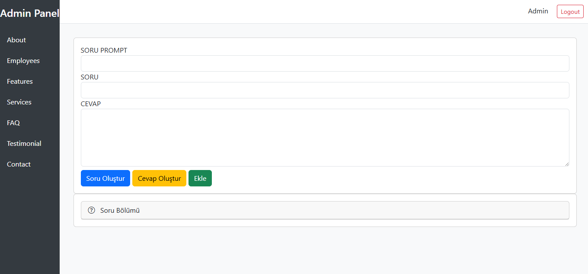
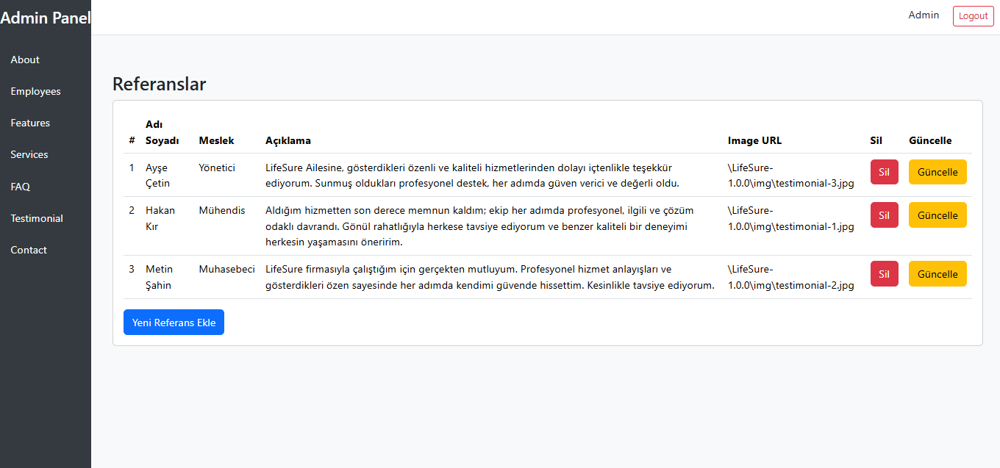
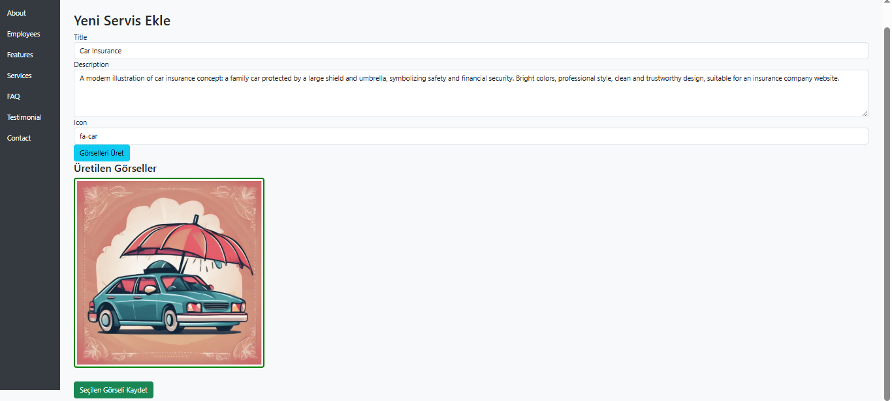
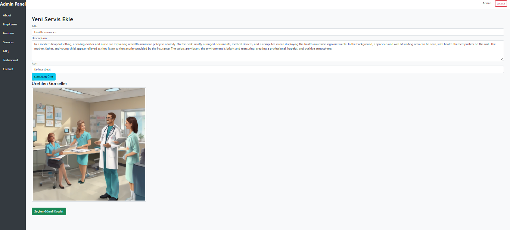
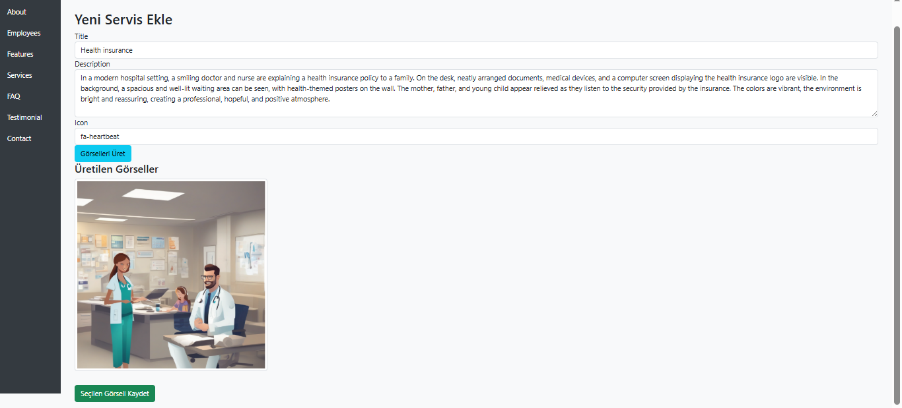

# LifeSure – Yapay Zekâ Destekli Sigorta Platformu

LifeSure, .NET MVC 4.7.2 ve Entity Framework (DB-First) mimarisiyle geliştirilen, modern bir sigorta firması web uygulamasıdır. Yapay zekâ entegrasyonları sayesinde içerik üretimini hızlandıran, sezgisel yönetici paneli ve kullanıcı dostu tasarımıyla öne çıkan bir dijital çözümdür.

---

## ⚙️ Yönetim Paneli Özellikleri

### 🗣️ AI Destekli Soru-Cevap Sistemi (FAQ)
- ✅ Sistem verilen konuya göre soru oluşturur  
- ✅ Sistem soruya göre cevap üretir  
- Soru, ChatGPT API (RapidAPI) üzerinden işlenir ve AI tarafından cevabı otomatik oluşturulur  
- Admin onayıyla soru ve cevap veritabanına kaydedilir  
- Sıkça Sorulan Sorular bölümü böylece dinamik şekilde oluşturulur  

### 🎨 Otomatik Hizmet Görselleri
- Admin, hizmete dair kısa bir açıklama girer (örnek: “Hayat Sigortası”)  
- Açıklama, Hugging Face text-to-image API aracılığıyla işlenir  
- Resmin URL’si Yapay Zeka tarafından üretilir ve adminin kullanımına sunulur  

### 🧾 İçerik Yönetimi (Tam Yetkili CRUD)
- Hizmetler  
- Slider İçerikleri  
- Referanslar  
- Çalışan Profilleri  
- Hakkımızda Sayfası  
- İletişim Bilgileri  

---

## 🌐 Kullanıcı Arayüzü Özellikleri

### 📱 Mobil Uyumlu ve Şık Arayüz
- Bootstrap 5 ile geliştirilmiş modern UI  
- Tüm cihazlarda optimize edilmiş responsive yapı  

### ❓ Zeki SSS Alanı
- AI ile oluşturulan cevaplar akordeon yapıda kullanıcıya sunulur  

### 🖼️ Zengin Görselli Hizmet Kartları
- Her hizmet, AI görselleriyle desteklenerek sunulur  

### 🧑‍💼 Kurumsal İçerikler
- Ekip, Referanslar, Hakkımızda ve İletişim sayfaları  

### 📊 Gerçek Zamanlı Sosyal Medya Takibi
- Instagram ve Twitter takipçi sayıları, RapidAPI üzerinden alınır  
- Admin paneline gerek kalmadan doğrudan arayüzde gösterilir  

### 🌍 Çok Dilli Altyapı
-  Türkçe ve  İngilizce dil desteği  
- Tüm içerikler .resx dosyalarıyla kontrol edilir  
- Dil seçimi, kullanıcı tarafından arayüzden yapılabilir  
- Controller ve View seviyesinde dinamik olarak yönetilir  

---

## 🔗 Entegrasyonlar ve Kullanılan Teknolojiler

| Teknoloji | Açıklama |
|-----------|---------|
| 🧱 .NET MVC 4.7.2 | Web uygulama çatısı |
| 🗃️ Entity Framework (DB-First) | Mevcut veritabanından model üretimi |
| 🛢️ SQL Server | Veritabanı sistemi |
| 🎨 Bootstrap 5 | Responsive arayüz |
| ✨ jQuery UI | Animasyon ve etkileşimler |
| 💬 ChatGPT API | AI ile cevap üretimi (RapidAPI) |
| 🖼️ Hugging Face API | Metne göre görsel üretimi |
| 📲 Instagram  API | Takipçi bilgisi çekme (RapidAPI) |
| 👨‍💻 C# | Backend geliştirme dili |

### ⚙️ Admin Paneli

### ⚙️ UI

